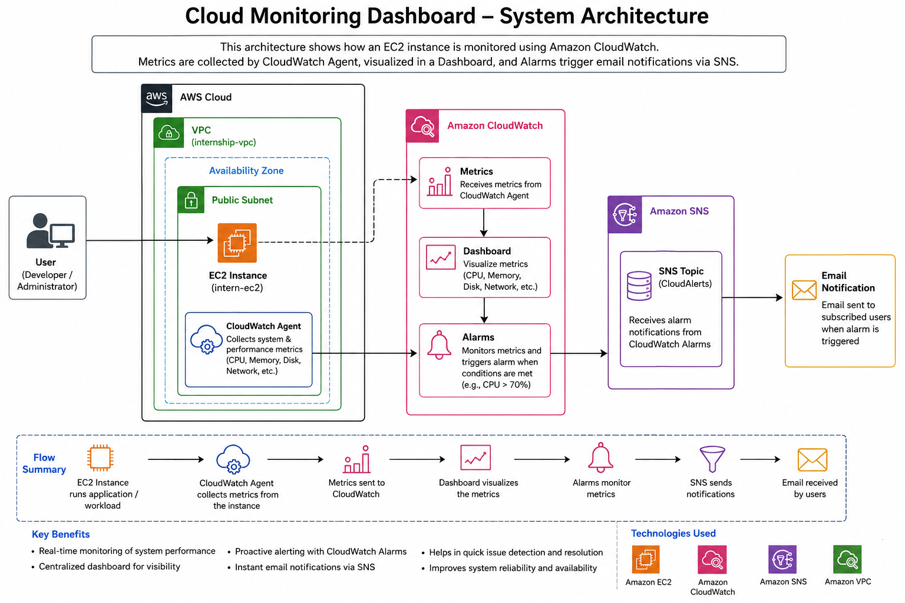
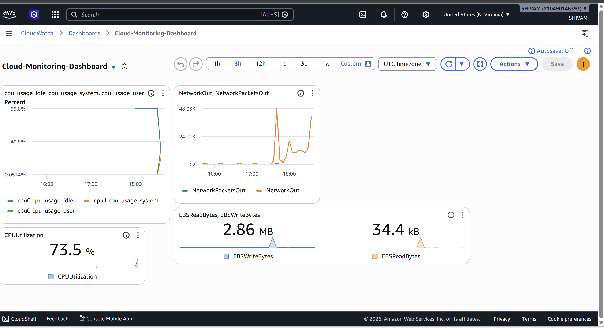

# ☁️ Cloud Monitoring Dashboard using AWS CloudWatch

A real-time cloud monitoring solution built on AWS that monitors an Amazon EC2 instance using **Amazon CloudWatch**, **CloudWatch Agent**, **CloudWatch Dashboard**, **CloudWatch Alarms**, and **Amazon SNS**. The project automatically detects high CPU utilization and sends email alerts to administrators.

---

## 📖 Project Overview

Cloud monitoring is essential for maintaining the health, performance, and availability of cloud resources. This project demonstrates how to configure a complete monitoring solution for an EC2 instance using AWS native services.

The CloudWatch Agent collects system-level metrics such as CPU, memory, disk, and network usage. These metrics are visualized in a CloudWatch Dashboard. When CPU utilization exceeds a predefined threshold, CloudWatch triggers an alarm that publishes a notification to Amazon SNS, which sends an email alert to the subscribed user.

---

## 🚀 Features

- ✅ Real-time EC2 monitoring
- ✅ CloudWatch Agent configuration
- ✅ Custom CloudWatch metrics
- ✅ Interactive CloudWatch Dashboard
- ✅ CPU Utilization Monitoring
- ✅ Network Traffic Monitoring
- ✅ EBS Read/Write Monitoring
- ✅ CloudWatch Alarm
- ✅ Amazon SNS Email Notification
- ✅ High CPU Load Simulation

---

# 🏗️ System Architecture



---

# 📊 Workflow

```text
EC2 Instance
      │
      ▼
CloudWatch Agent
      │
      ▼
CloudWatch Metrics
      │
      ▼
CloudWatch Dashboard
      │
      ▼
CloudWatch Alarm
      │
      ▼
Amazon SNS Topic
      │
      ▼
Email Notification
```

---

# 🛠️ AWS Services Used

| Service | Purpose |
|----------|----------|
| Amazon EC2 | Virtual Linux Server |
| Amazon CloudWatch | Monitoring Service |
| CloudWatch Agent | Collects System Metrics |
| Amazon SNS | Email Notifications |
| IAM | Permissions |
| Amazon VPC | Networking |

---

# 📂 Project Structure

```text
Cloud-Monitoring-Dashboard/
│
├── README.md
├── architecture.png
│
└── screenshots/
    ├── dashboard.png
    ├── Alarm.png
    ├── Alarm OK.png
    ├── Email.png
    ├── SNS.png
    └── ec2-Process.png
```

---

# ⚙️ Setup Guide

## 1. Launch an EC2 Instance

- Amazon Linux 2023
- t3.micro
- Attach IAM Role with CloudWatch permissions

---

## 2. Install CloudWatch Agent

```bash
sudo yum install amazon-cloudwatch-agent -y
```

Verify installation

```bash
amazon-cloudwatch-agent-ctl -h
```

---

## 3. Configure CloudWatch Agent

```bash
sudo /opt/aws/amazon-cloudwatch-agent/bin/amazon-cloudwatch-agent-config-wizard
```

Configuration used:

- Linux
- Run as **cwagent**
- Host Metrics → Yes
- Logs → No
- X-Ray → No
- Store in Parameter Store → No

---

## 4. Start Agent

```bash
sudo /opt/aws/amazon-cloudwatch-agent/bin/amazon-cloudwatch-agent-ctl \
-a fetch-config \
-m ec2 \
-c file:/opt/aws/amazon-cloudwatch-agent/etc/amazon-cloudwatch-agent.json \
-s
```

---

## 5. Verify Metrics

Navigate to:

```
CloudWatch
   ↓
Metrics
   ↓
CWAgent
```

Collected Metrics:

- cpu_usage_idle
- cpu_usage_user
- cpu_usage_system
- mem_used_percent
- disk_used_percent
- diskio_io_time

---

## 6. Create Dashboard

Dashboard Name

```
Cloud-Monitoring-Dashboard
```

Widgets Added

- CPU Usage
- CPU Utilization
- Network In
- Network Out
- EBS Read Bytes
- EBS Write Bytes

---

## 7. Create Alarm

Metric

```
CPUUtilization
```

Condition

```
Greater than 70%
```

Evaluation

```
3 Datapoints within 3 Minutes
```

Alarm Name

```
HighCPUAlarm
```

---

## 8. Configure SNS

Topic

```
CloudAlerts
```

Protocol

```
Email
```

Subscribe your email and confirm the subscription.

---

## 9. Test the Alarm

Generate CPU load:

```bash
yes > /dev/null &
yes > /dev/null &
yes > /dev/null &
yes > /dev/null &
yes > /dev/null &
```

Verify CPU:

```bash
top
```

Stop the load:

```bash
pkill yes
```

---

# 📸 Screenshots

Add screenshots inside the **screenshots** folder.

### Dashboard



### Alarm Triggered


### Alarm Returned to OK


### SNS Topic


### Email Notification


---

# 📈 Results

- CloudWatch Agent successfully collected system metrics.
- Dashboard displayed CPU, Network, and EBS performance.
- CloudWatch Alarm detected high CPU utilization.
- Amazon SNS successfully delivered email notifications.
- Alarm automatically returned to **OK** after CPU usage normalized.

---

# 🎯 Learning Outcomes

- AWS Cloud Monitoring
- Infrastructure Monitoring
- Performance Analysis
- CloudWatch Dashboards
- CloudWatch Alarms
- Amazon SNS
- Linux Administration
- EC2 Monitoring
- Incident Alerting

---

# 🔮 Future Enhancements

- Memory Usage Alerts
- Disk Usage Monitoring
- CloudWatch Logs
- Auto Scaling Integration
- Lambda Automation
- Slack Notifications
- Systems Manager Integration

---

# 👨‍💻 Author

**Shivam Akash**

---

# ⭐ If you found this project helpful, please give it a Star!
